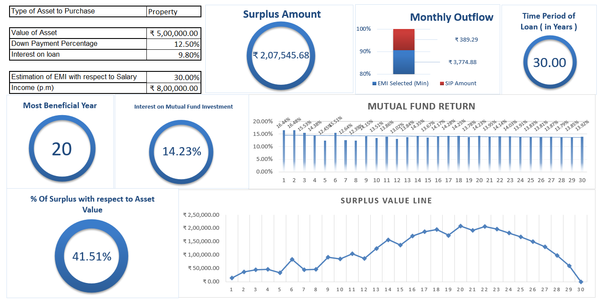

# 📈 SIP vs EMI: Macro-Driven Financial Decision Model

## 🧠 About the Project
This macro-enabled Excel model is designed to evaluate the long-term financial trade-offs between investing via Systematic Investment Plans (SIPs) and asset acquisition through Equated Monthly Installments (EMIs). It offers a data-driven simulation of real-world behavioral finance scenarios, enabling users to test personalized investment journeys based on tenure, interest rates, asset values, and SIP returns. 

The goal: empower smarter capital allocation decisions backed by dynamic forecasting, scenario visualization, and clear break-even logic — all built within a self-contained Excel framework with macro automation.

---

## 📊 Key Features
- 🔁 **Macro-powered dynamic dashboard** that adjusts instantly based on input changes
- 📊 **Side-by-side SIP vs EMI financial progression** tracked monthly and yearly
- 🔍 **Scenario toggling**: Change tenure, loan interest rate, SIP CAGR, asset type & inflation factors
- 📈 **Advanced visualization layer** highlighting:
  - Surplus wealth generation vs EMI burden
  - Crossover year (SIP outperforming EMI)
  - Interest paid vs interest earned analysis
- 💡 **Minimal manual input required** – maximum automation for clarity and speed

---

## 📌 Strategic Use Cases
- 💰 **Personal Finance Optimization**: Plan smarter between buying vs investing
- 🧮 **Financial Advisory Simulation**: Present forecast scenarios to clients
- 🎓 **Academic & Behavioral Finance Demonstration**: Model optimal decision windows for capital leverage

---

## 📁 Files Included
- `SIP_vs_EMI_Model.xlsm`: Fully functional Excel model with integrated macros, formulas, and visualization components

---

## 🛠️ Tools, Concepts & Frameworks Used
- **Microsoft Excel (VBA/macros, slicers, form controls)**
- **Financial Modeling**: SIP forecasting, EMI amortization, surplus investment modeling
- **Data Visualization**: Chart layering, dynamic ranges, toggle-linked visuals
- **Behavioral Finance**: Crossover-year simulation, psychological payoff tracking
- **Formula Logic**:
  - `IF()`, `INDEX()`, `MATCH()`, `MAX()`, `MIN()`, `COLUMN()`, `IFERROR()`
  - Financial functions: `PMT()` for EMI, `FV()` for SIP projections

---

## 🔐 Accuracy, Reliability & Automation
- The model is optimized to maintain **zero communication error** between input-output blocks.
- Logical checks prevent formula breakage and ensure seamless data transitions.
- It allows users to explore **"what-if" analyses** with real-time insight delivery.

---

## 📬 Contact
For inquiries, collaboration, or use-case discussion, feel free to reach out:

**📧 Email**: mananmahi.mahi@gmail.com  
**🔗 LinkedIn**: [linkedin.com/in/ms01](https://linkedin.com/in/ms01)

